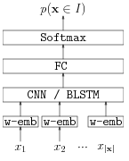

# Neural Networks for Data Selection 
 
This repository contains the code for the paper "[Neural Networks Classifier for Data Selection in Statistical Machine Translation](http://arxiv.org/abs/1612.05555)"
 
Built upon our fork of [Keras](https://github.com/MarcBS/keras) and tested for the [Theano](http://deeplearning.net/software/theano)
backend.

## Features

* Neural network-based sentence classifiers, either at monolingual and bilingual level.

* BLSTMs / CNNs classifiers. Easy to extend. 

* Support for including Glove or Word2Vec pretrained word vectors ([binary](https://github.com/lvapeab/sentence-selectioNN/blob/master/utils/preprocess_binary_vectors.py) or [text](https://github.com/lvapeab/sentence-selectioNN/blob/master/utils/preprocess_text_vectors.py) formats).   


* Iterative semi-supervised selection from top/bottom scoring sentences from an out-of-domain corpus. 


## Installation

Provided that you have [pip](https://en.wikipedia.org/wiki/Pip_(package_manager)) installed, run:
  
  ```bash
  git clone https://github.com/lvapeab/sentence-selectioNN
  cd sentence-selectioNN
  pip install -r requirements.txt
  ```
 
 for obtaining the required packages for running this library.
 
`sentence-selectioNN` requires the following libraries:

 - [Our version of Keras](https://github.com/MarcBS/keras) 
 - [Multimodal Keras Wrapper](https://github.com/lvapeab/multimodal_keras_wrapper) 

## Instructions:

Assuming you have a corpus:

1) Check out the inputs/outputs of your model in `data_engine/prepare_data.py`

2) If you want to use pretrained word vectors, use the preprocessing scripts for [binary](https://github.com/lvapeab/sentence-selectioNN/blob/master/utils/preprocess_binary_vectors.py) or [text](https://github.com/lvapeab/sentence-selectioNN/blob/master/utils/preprocess_text_vectors.py) for pretrained Glove or Word2Vec vectors. 

3) Set a model configuration in `config.py`

4) Train!:

  ```bash
 python main.py
 ```

## Architecture

We support two different network architecture, BLSTM or CNN, both at monolingual or bilingual level. 




Please, see [the paper](http://arxiv.org/abs/1612.05555) for a more detailed description of the model.


## Citation

If you use this code for any purpose, please cite the following paper:

```
Peris Á., Chinea-Rios M., Casacuberta F. 
Neural Networks Classifier for Data Selection in Statistical Machine Translation. 
n Proceedings of EAMT, IN PRESS. 2017.
```


## Contact

Álvaro Peris ([web page](http://lvapeab.github.io/)): lvapeab@prhlt.upv.es
